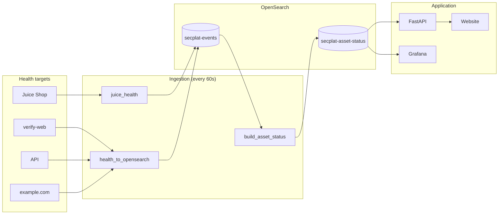

# Security Posture Platform

A local, containerised **security posture and observability lab** that demonstrates how security and reliability signals flow from running services → **OpenSearch** → **derived asset posture** → **Grafana dashboards + alerts**.

The goal is to show **how security platforms are built internally** (CSPM / ASM / SIEM-lite), not just how dashboards are used.

Everything runs locally using **Docker Compose**, is easy to inspect and break, and mirrors real internal security tooling patterns.

---

## Key characteristics

- Fully local (`127.0.0.1` only)
- Event-driven (raw signals → derived posture)
- Asset-centric (one current state per asset)
- Cron-driven ingestion (no Prometheus required)
- Grafana dashboards provisioned as code

---

## What’s running

| Service            | Purpose                                   | Port |
|--------------------|-------------------------------------------|------|
| **Frontend (Next.js)** | Main UI: login, overview, assets, alerts, reports, Grafana embed | 3002 |
| API (FastAPI)      | Core backend, JWT auth, posture API (source of truth) | 8000 |
| PostgreSQL         | Asset inventory & metadata                 | 5432 |
| OpenSearch         | Events + derived asset status              | 9200 |
| Redis              | Queue (Phase 1+); streams for jobs/notify  | 6379 |
| Grafana            | Dashboards & alerting (read-only on OpenSearch) | 3001 |
| Juice Shop         | Demo health-check target                   | 3000 |
| verify-web (nginx) | Domain / ownership verification            | 8081 |
| web (nginx)        | Simple static proxy to API (optional)      | 8082 |
| ingestion          | Health + posture scripts every 60s (no host cron) | —    |

All services are **local-only**. Nothing is exposed externally.

---

## Data flow (architecture)

**Single source of truth:** FastAPI reads from OpenSearch and exposes a **canonical asset state schema**. The website and reports use only this API. Grafana visualises the same data (read-only); it does not define business logic.



**In words:**

1. **Ingestion** (container) runs every 60s: health checks → `secplat-events`; `build_asset_status.sh` → latest event per asset → `secplat-asset-status`.
2. **Website** (Next.js, port 3002) → **FastAPI** (posture summary, list, detail, reports) → **OpenSearch** (read). Login: JWT; pages: Overview, Assets, Asset detail (timeline, evidence, recommendations), Alerts, Reports (CSV + summary), Grafana embed.
3. **Grafana** (port 3001) reads OpenSearch for dashboards and alert rules; it does not compute posture (FastAPI does).

Supporting components:

- **verify-web**: static nginx for `/.well-known/secplat-verification.txt`
- **web** (optional): nginx serving a simple static page + API proxy on 8082

---

## Getting started

### Prerequisites

- Docker Engine
- Docker Compose v2
- **Linux/Ubuntu**: bash, curl, jq for running scripts on the host (optional; see below).
- **Windows**: No WSL or bash required. All ingestion runs inside the `ingestion` container.

### Start the stack

```bash
cd security-posture-platform
docker compose up -d --build
docker compose ps
```

On **Windows**, this is enough: the `ingestion` service runs the health and posture scripts inside Docker every 60 seconds, so you don't run any scripts on the host. On **Linux**, you can either use the same (recommended) or run the scripts via cron as in the [Continuous ingestion](#continuous-ingestion-cron) section.

---

## Sanity checks

```bash
# API health
curl http://localhost:8000/health

# OpenSearch availability
curl http://localhost:9200 | head

# Domain verification token
curl http://localhost:8081/.well-known/secplat-verification.txt
```

---

## Testing Jobs (scan worker)

1. **Start the worker** (processes queued scan jobs):
   ```bash
   docker compose up -d worker-web
   ```
2. **Create a job** from the UI: open **Jobs** in the nav, use the **Enqueue job** form (analyst/admin only). Pick type `web_exposure`, optionally set an Asset ID (e.g. an asset with type `external_web`), click **Enqueue**.
3. **Refresh the Jobs list** — the job appears as queued, then (once the worker picks it up) running, then done or failed. Click a job to see **logs**; use **Retry** on failed jobs.

Without the worker running, jobs stay in **queued** until you start `worker-web`.

---

## Domain / ownership verification

The platform exposes a **well-known verification path**, similar to real SaaS security tools.

```
/.well-known/secplat-verification.txt
```

Source in repo:

```
infra/verify-web/.well-known/secplat-verification.txt
```

This demonstrates how **asset ownership or control can be verified** before monitoring or scanning is allowed.

---

## OpenSearch indices

### Raw events (append-only)

Health signals are written to:

```
secplat-events
```

Example event:

```json
{
  "@timestamp": "2026-02-02T22:06:01Z",
  "service": "api",
  "asset": "secplat-api",
  "level": "health",
  "status": "up",
  "status_num": 1,
  "code": 200,
  "latency_ms": 32
}
```

### Derived posture (current state per asset)

Current posture is stored in:

```
secplat-asset-status
```

This index contains **one document per asset** (upserted by `asset_key`).

---

## Asset posture model

Posture is represented using:

| State   | status_num | Meaning                    |
| ------- | ---------- | -------------------------- |
| UP      | `1`        | Asset responding normally  |
| STALE   | `0`        | No recent health events    |
| UNKNOWN | `-1`       | No health events ever seen |
| DOWN    | `-2`       | Explicit failure detected  |

### Posture scoring (secplat-asset-status)

Each asset document includes derived scoring fields:

| Field               | Meaning |
| ------------------- | ------- |
| `posture_score`     | 0–100 (0 = bad, 100 = good) |
| `posture_state`     | `green` \| `amber` \| `red` |
| `last_seen`         | Last health event time |
| `staleness_seconds`  | Seconds since last event |
| `last_status_change`| When status last changed |

Scoring logic:

- `status_num == -2` (DOWN) → score `0`, state `red`
- `status_num == -1` (UNKNOWN) → score `0`, state `red`
- `status_num == 1` (UP) and stale (>5 min) → score `60`, state `amber`
- `status_num == 1` and fresh → score `100`, state `green`

---

## Corporate roadmap (multi-service workflow)

A phased plan to split the system into queue-driven services (deriver, scan-workers, notifier, correlator) and eventually Kubernetes is in **[docs/SECPLAT-CORPORATE-ROADMAP.md](docs/SECPLAT-CORPORATE-ROADMAP.md)**. One-page architecture (current + target) and service boundaries: **[docs/architecture.md](docs/architecture.md)**. Canonical event envelope and idempotency keys: **[docs/contracts/](docs/contracts/)**.

**Minimal MVP split (implement first):** Redis Streams queue → Deriver → Scan worker pool → Notifier → Correlator (Phase 3.1). **Phase 3.2:** Maintenance windows and suppression rules (DB + API under `/suppression/*`); down-asset alerts and finding→incident correlation exclude suppressed assets.

---

## Architecture & design principles

- **Events ≠ state** — `secplat-events` is append-only; posture decisions use **current** state in `secplat-asset-status`, not historical queries.
- **Posture is current, not historical** — One document per asset, continuously overwritten by `build_asset_status.sh`.
- **Data model clarity > tooling** — If dashboards are wrong, alerts will be wrong; the pipeline is designed so posture is computed in one place (the script) and dashboards only read it.
- **Alerting** — Explored (e.g. LAST vs MAX reducers); currently **deferred** so the platform can focus on posture intelligence and dashboards first.

---

## Continuous ingestion (cron)

Two cron jobs drive the platform:

### 1) Health signal ingestion

Script:

```
scripts/health_to_opensearch.sh
```

* Probes API, verify-web, and a stable local target (Juice Shop) for repeatable demos
* Measures latency
* Emits health events into `secplat-events`

Example cron entries (run `assets_to_opensearch.sh` first or periodically so `secplat-assets` is populated):

```cron
* * * * * /home/labuser/security-posture-platform/scripts/health_to_opensearch.sh >/dev/null 2>&1
* * * * * /home/labuser/security-posture-platform/scripts/build_asset_status.sh >> /tmp/secplat_build_asset_status.log 2>&1
```

### 2) Asset posture builder

Script:

```
scripts/build_asset_status.sh
```

* Reads assets
* Pulls latest health events from OpenSearch
* Computes UP / STALE / UNKNOWN / DOWN
* Upserts one current-state doc per asset into `secplat-asset-status`

### 3) Validate posture docs (optional)

After ingestion, check that `secplat-asset-status` has the expected posture fields:

```bash
./scripts/validate_posture.sh
```

Requires `jq`. Checks for `posture_score`, `posture_state`, `staleness_seconds`, `last_status_change`, etc.

---

## Website (main UI)

Open **http://localhost:3002** after starting the stack.

- **Login:** `admin` / `admin` (configurable via `ADMIN_USERNAME`, `ADMIN_PASSWORD`).
- **Overview:** Green/amber/red counts, posture score, down assets list.
- **Assets:** Table with status, criticality, owner, env; click for detail (timeline, evidence, recommendations, SLO).
- **Alerts:** Currently firing (down assets from API) + link to Grafana alerting.
- **Reports:** Summary (uptime %, avg latency, top incidents) + CSV export.
- **Grafana:** Embedded posture dashboard (deep dive).

All API calls go through FastAPI (canonical schema). See [Testing](docs/TESTING-SECPLAT.md) for a full test plan.

---

## Posture API

Endpoints require **Bearer token** (from `POST /auth/login`). The API is the **source of truth** for posture; it reads OpenSearch and returns a canonical schema.

| Endpoint | Description |
| -------- | ----------- |
| `POST /auth/login` | Form: `username`, `password` → JWT |
| `GET /posture` | List all assets (canonical schema). `?format=csv` for export |
| `GET /posture/summary` | Green/amber/red counts, `posture_score_avg`, `down_assets` |
| `GET /posture/reports/summary?period=24h` | Report: uptime %, avg latency, top incidents |
| `GET /posture/{asset_key}` | One asset (current state) |
| `GET /posture/{asset_key}/detail?hours=24` | State + timeline + evidence + recommendations + completeness/SLO |
| `GET /queue/health` | Phase 1: Redis status and stream depths (`secplat.jobs.scan`). Returns `not_configured` if REDIS_URL unset. |
| `POST /posture/alert/send` | If any assets are down and `SLACK_WEBHOOK_URL` is set, send Slack message; returns `sent`, `down_assets`, `message`. Call from cron or manually. |
| `POST /posture/reports/snapshot?period=24h` | Save current report summary to DB; returns stored snapshot with `id`, `created_at`. |
| `GET /posture/reports/history?limit=20` | List stored report snapshots (newest first). |
| `GET /posture/reports/history/{id}` | Get one stored snapshot by id. |

**Report history:** Snapshots are stored in `posture_report_snapshots`. New installs get the table from `init.sql`; for an existing DB run `infra/postgres/migrations/003_report_snapshots.sql`.

Optional env: `SLACK_WEBHOOK_URL` (Slack Incoming Webhook) and/or **WhatsApp (Twilio)**. When set, `POST /posture/alert/send` notifies when `down_assets` is non-empty. For WhatsApp: set `TWILIO_ACCOUNT_SID`, `TWILIO_AUTH_TOKEN`, `TWILIO_WHATSAPP_FROM` (e.g. `whatsapp:+14155238886` for sandbox), `WHATSAPP_ALERT_TO` (e.g. `whatsapp:+1234567890`). You can use WhatsApp only, Slack only, or both.

**Integrations (B.4):** **Jira** — create a ticket from an incident: set `JIRA_*`; on Incident detail use **Create Jira ticket** (or `POST /incidents/:id/jira`). **Slack interactive** — optional: `SLACK_SIGNING_SECRET` + Interactivity URL to `.../integrations/slack/interactions` for “Create Jira” button. **WhatsApp incoming** — optional: set Twilio WhatsApp webhook to `POST .../integrations/whatsapp/incoming` to receive replies (signature validated if `TWILIO_AUTH_TOKEN` set).

Example (PowerShell): see `scripts/test-api.ps1`. With token: `GET /posture/summary`, `GET /posture/juice-shop/detail`.

---

## Grafana dashboards

Grafana runs at:

```
http://localhost:3001
```

### Provisioned dashboards

Dashboards are provisioned as code and auto-loaded on startup:

* `infra/grafana/dashboards/secplat-posture.json`
* `infra/grafana/provisioning/dashboards/dashboards.yaml`

---

## Alerting

Alerting has been explored (e.g. LAST vs MAX reducers for “broken right now” vs “ever broken”) and is **intentionally paused**. Focus is on posture scoring and dashboards; alerts can be re-enabled later once the data model and panels are stable.

---

## Development workflow

```bash
# View logs
docker compose logs -f api

# Restart Grafana
docker compose restart grafana

# Validate compose file
docker compose config > /dev/null && echo "compose ok"
```

---

## Security notes

* All ports are bound to `127.0.0.1`
* OpenSearch security plugins disabled (local lab)
* Grafana credentials configurable via `.env`

This repository is a learning and experimentation environment, not a hardened production deployment.

---

## Why this project exists

This project demonstrates:

* How security signals are generated
* How events are indexed
* How posture is derived
* How assets are tracked
* How dashboards are provisioned
* How alerting turns posture into detection

If you can reason about this system, you can reason about internal security tooling used in real organisations.

---

## Next steps (optional)

* **Alert action:** Send to Slack/email when `down_assets` is non-empty
* **Weekly report job:** Cron that calls report API and emails or stores snapshot
* **Owner/criticality from Postgres:** Merge asset metadata into posture views
* **Grafana drill-down:** Dashboard with `$asset` variable, linked from website asset detail
* **OAuth or read-only role:** Second user or GitHub/Google login

