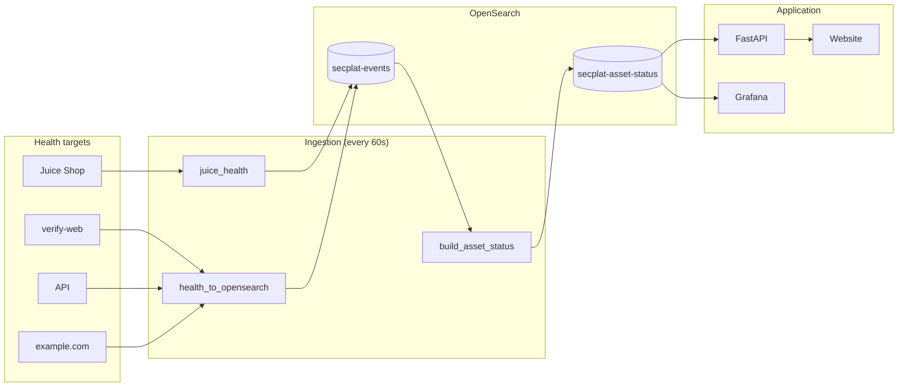

# SecPlat — Security Posture Platform

**SecPlat is a self-hostable security posture platform.** Connect a data source
(start with a read-only GitHub scan), and it turns raw security signals into
prioritised findings, live posture scoring, alerts, incidents, and
auditor-ready **SOC 2 evidence** — in one open-source workspace you fully control.

It is a real, working product: Next.js + FastAPI + PostgreSQL + OpenSearch,
run with a single `docker compose up`. Open source under the
[AGPL-3.0](LICENSE); managed hosting and commercial licensing are available (see
[COMMERCIAL.md](COMMERCIAL.md)).

---

## Why teams use it

- **Understand risk fast** — one live view of asset health, exposure, and the
  findings that actually matter, instead of another raw alert firehose.
- **Turn findings into compliance evidence** — SOC 2 controls mapped
  automatically from live posture, exportable as an auditor-ready PDF.
- **Operate incidents end to end** — alerts → triage → incidents → response, with
  AI-assisted context and a full audit trail.
- **Own your data** — self-hosted, no lock-in, and (verified) no telemetry: the
  platform phones home to no one. See [SECURITY.md](SECURITY.md).

---

## Try it in 5 minutes

**Prerequisites:** Docker Engine + Docker Compose v2, and ~8 GB free RAM
(OpenSearch is the heavy component). Works on Linux, macOS, and Windows — no WSL
or host scripts required; all ingestion runs inside a container.

```bash
git clone https://github.com/viss2423/security-posture-platform
cd security-posture-platform
cp .env.example .env            # then edit: set API_SECRET_KEY + the passwords
docker compose up -d --build
docker compose ps               # wait until services are healthy (~1–2 min)
```

Then open **http://localhost:3000** and either:

- **Sign in** with `admin` / `admin` (dev default — the API refuses this once
  `ENV=prod`), which gives you the full operator workspace, or
- **Create an account** on the login page for a self-service **demo sandbox**: a
  read-only tour of every feature with sample data, safe to explore.

That's it — nothing is exposed to your network (every port binds to `127.0.0.1`),
so it's safe to run on your laptop.

> **Deploying for a team or in production?** The defaults above are for local
> evaluation. Follow **[docs/DEPLOY.md](docs/DEPLOY.md)** to put the app online
> with a domain and free HTTPS (Oracle free tier, $0), and read
> **[SECURITY.md](SECURITY.md)** for the hardening checklist (TLS, real secrets,
> `ENV=prod`, access control) you must complete before exposing SecPlat.

---

## What you'll see (roles)

SecPlat has three roles, so you can hand a demo login to anyone safely:

| Role | Who | Access |
|------|-----|--------|
| **viewer** | self-registered / demo users | Read-only. Interactive demo sandbox (overview, assets, findings); every other feature shown as a static sample preview. Never sees real operator data. |
| **analyst** | your security team | Full interactive workspace — alerts, incidents, telemetry, detections, automation, scans. |
| **admin** | platform owners | Everything, plus user & access management. |

Promote a demo user to analyst/admin under **Team Access** (admin only).

---

## Explore the product without installing

The public landing page walks through the product, an interactive "how it works"
flow, and a sample SOC 2 evidence experience — a good first stop before you
self-host.

---

## Architecture at a glance

**Single source of truth:** FastAPI reads from OpenSearch and exposes a **canonical asset state schema**. The website and reports use only this API. Grafana visualises the same data (read-only); it does not define business logic.


```mermaid
flowchart LR
  subgraph targets["Health targets"]
    J[Juice Shop]
    V[verify-web]
    A[API]
    E[example.com]
  end

  subgraph ingestion["Ingestion (every 60s)"]
    H[health_to_opensearch]
    JH[juice_health]
    B[build_asset_status]
  end

  subgraph storage["OpenSearch"]
    EV[(secplat-events)]
    ST[(secplat-asset-status)]
  end

  subgraph app["Application"]
    API[FastAPI]
    FE[Website]
    GF[Grafana]
  end

  J --> JH
  V --> H
  A --> H
  E --> H
  JH --> EV
  H --> EV
  EV --> B
  B --> ST
  ST --> API
  API --> FE
  ST --> GF
```

**In words:** the **FastAPI** backend is the single source of truth — it reads
raw signals from **OpenSearch**, derives canonical asset posture, and serves it to
the **Next.js** frontend and to **Grafana** (read-only dashboards). Ingestion runs
continuously in its own container. Business logic lives in the API, never in the
dashboards.

### Services and ports

A default `docker compose up` starts the **lean local lane**. Every port binds to
`127.0.0.1` — nothing is reachable from your network.

| Service | Purpose | URL (default) | Profile |
|---------|---------|---------------|---------|
| **Frontend** (Next.js) | Main UI — the app you log into | http://localhost:3000 | default |
| **API** (FastAPI) | Backend, JWT auth, posture source of truth | http://localhost:8000 | default |
| PostgreSQL | Asset inventory, users, findings, audit log | `localhost:5433` | default |
| OpenSearch | Raw events + derived asset status | http://localhost:9200 | default |
| Redis | Job queue and notify streams | `localhost:6379` | default |
| ingestion | Runs health + posture builders every 60s | — | default |
| Juice Shop | Sample scan/health target | http://localhost:3002 | default |
| verify-web | Domain / ownership verification endpoint | http://localhost:8081 | default |
| Grafana | Dashboards & alerting (read-only on OpenSearch) | http://localhost:3001 | `observability` |
| worker-web | Processes queued scan jobs | — | `jobs` |

Start optional components with their profile, e.g.:

```bash
docker compose --profile observability up -d grafana     # dashboards
docker compose --profile jobs up -d worker-web           # scan job worker
docker compose --profile cyberlab up -d suricata zeek cowrie  # live IDS/honeypot demo
```

> **Production / Kubernetes:** do not run the Compose app and the Kubernetes
> workloads at the same time. The supported production path renders a signed
> release bundle rather than using the placeholder digests under `infra/k8s`.
> See the render/verify scripts under `services/api/scripts/` and
> [docs/architecture.md](docs/architecture.md) for the Kubernetes path.

---

## Verify it's working

After `docker compose up`, confirm the stack is healthy:

```bash
# All services should show "running"/"healthy"
docker compose ps

# API health — expect {"status":"ok"}
curl http://localhost:8000/health

# OpenSearch is up
curl http://localhost:9200 | head
```

Then open **http://localhost:3000**, sign in, and you should land on the
**Overview** with a posture score and sample assets. Create a second account from
the login page to see the read-only **demo sandbox**.

### Troubleshooting

| Symptom | Fix |
|---------|-----|
| `variable is not set` warnings on startup | You skipped `cp .env.example .env`. Copy it and re-run. |
| Frontend won't load / port 3000 in use | Another app owns port 3000. Set `FRONTEND_PORT` in `.env` and restart. |
| OpenSearch container keeps restarting | It needs RAM and a valid admin password. Ensure ~8 GB free and that `OPENSEARCH_INITIAL_ADMIN_PASSWORD` meets complexity rules (upper/lower/digit/symbol). |
| API returns 503 on login | You set `ENV=prod` with the default `admin` password. Set `ADMIN_PASSWORD`/`ADMIN_PASSWORD_HASH` (see [SECURITY.md](SECURITY.md)). |
| Grafana link 404s | Grafana is profile-gated: `docker compose --profile observability up -d grafana`. |

Full teardown (removes data volumes too):

```bash
docker compose down -v
```

---

## Testing Jobs (scan worker)

1. **Start the worker** (processes queued scan jobs):
   ```bash
   docker compose --profile jobs up -d worker-web
   ```
2. **Create a job** from the UI: open **Jobs** in the nav, use the **Enqueue job** form (analyst/admin only). Pick a supported async type such as `web_exposure`, optionally set an Asset ID (for `web_exposure`, use an asset with type `external_web`), click **Enqueue**.
3. **Refresh the Jobs list** — the job appears as queued, then (once the worker claims it over the internal API) running, then done or failed. Click a job to see **logs**; use **Retry** on failed jobs.

Without the worker running, jobs stay in **queued** until you start `worker-web`.

### Worker control-plane contract test (recommended)

This checks the supported worker topology: Redis delivery plus internal API claim/execute/complete/fail calls, without any direct worker Postgres dependency.

Run this from repo root:

```powershell
$repo = (Get-Location).Path
docker run --rm -v "${repo}:/work" -w /work security-posture-platform-worker-web:latest sh -lc "pip install -q pytest && pytest services/worker-web/tests/test_job_claim_race.py -q"
```

Expected: `2 passed`.

More roadmap tests are in **[docs/TESTING-CORPORATE-ROADMAP.md](docs/TESTING-CORPORATE-ROADMAP.md)**.

---

## Domain / ownership verification

The platform exposes a **well-known verification path**, similar to real SaaS security tools.

```
/.well-known/secplat-verification.txt
```

Source in repo:

```
infra/verify-web/.well-known/secplat-verification.txt
```

This demonstrates how **asset ownership or control can be verified** before monitoring or scanning is allowed.

---

## OpenSearch indices

### Raw events (append-only)

Health signals are written to:

```
secplat-events
```

Example event:

```json
{
  "@timestamp": "2026-02-02T22:06:01Z",
  "service": "api",
  "asset": "secplat-api",
  "level": "health",
  "status": "up",
  "status_num": 1,
  "code": 200,
  "latency_ms": 32
}
```

### Derived posture (current state per asset)

Current posture is stored in:

```
secplat-asset-status
```

This index contains **one document per asset** (upserted by `asset_key`).

---

## Asset posture model

Posture is represented using:

| State   | status_num | Meaning                    |
| ------- | ---------- | -------------------------- |
| UP      | `1`        | Asset responding normally  |
| STALE   | `0`        | No recent health events    |
| UNKNOWN | `-1`       | No health events ever seen |
| DOWN    | `-2`       | Explicit failure detected  |

### Posture scoring (secplat-asset-status)

Each asset document includes derived scoring fields:

| Field               | Meaning |
| ------------------- | ------- |
| `posture_score`     | 0–100 (0 = bad, 100 = good) |
| `posture_state`     | `green` \| `amber` \| `red` |
| `last_seen`         | Last health event time |
| `staleness_seconds`  | Seconds since last event |
| `last_status_change`| When status last changed |

Scoring logic:

- `status_num == -2` (DOWN) → score `0`, state `red`
- `status_num == -1` (UNKNOWN) → score `0`, state `red`
- `status_num == 1` (UP) and stale (>5 min) → score `60`, state `amber`
- `status_num == 1` and fresh → score `100`, state `green`

---

## Corporate roadmap (multi-service workflow)

A phased plan to split the system into queue-driven services (deriver, scan-workers, notifier, correlator) and eventually Kubernetes is in **[docs/SECPLAT-CORPORATE-ROADMAP.md](docs/SECPLAT-CORPORATE-ROADMAP.md)**. One-page architecture (current + target) and service boundaries: **[docs/architecture.md](docs/architecture.md)**. Canonical event envelope and idempotency keys: **[docs/contracts/](docs/contracts/)**. Error payload and retryability conventions: **[docs/error-conventions.md](docs/error-conventions.md)**.

Platform-maturity implementation phases (zero-trust, queue reliability, detection engineering, SOC correlation, evidence, observability) are tracked in **[docs/maturity-plan.md](docs/maturity-plan.md)**.

**Minimal MVP split (implement first):** Redis Streams queue → Deriver → Scan worker pool → Notifier → Correlator (Phase 3.1). **Phase 3.2:** Maintenance windows and suppression rules (DB + API under `/suppression/*`); down-asset alerts and finding→incident correlation exclude suppressed assets.

**Phase 4 (Policy v2, Option A):** Policy evaluation now supports evidence-backed rule violations and persisted evaluation history via `/policy/bundles/{id}/evaluate`, `/policy/bundles/{id}/evaluations`, and `/policy/bundles/{id}/evaluations/{evaluation_id}`.

**Phase 5 starter (Kubernetes):** baseline manifests are available under `infra/k8s/` (Deployments for api/deriver/worker-web/notifier/correlator, worker HPA, ingestion/snapshot CronJobs, and NetworkPolicies with hardened pod security settings). For local Docker Desktop testing, use `infra/k8s/overlays/docker-desktop` (see `infra/k8s/README.md`).

Service identities are supported for internal workloads (scanner, ingestion, correlator) so background services do not need admin credentials.

## AI enrichments (Phase AI-1)

SecPlat now supports optional AI-driven enrichments (disabled by default):

- Incident executive summaries (persisted per incident)
- Asset diagnosis briefs (persisted per asset)
- Alert response guidance (persisted per asset alert context)
- Failed job triage guidance (persisted per job)
- Finding triage explanations (persisted per finding)
- Posture anomaly detection over trend metrics (persisted history)
- ML-ready risk scoring pipeline with heuristic fallback and trainable artifact support

### API endpoints

- `POST /ai/incidents/{incident_id}/summary/generate`
- `GET /ai/incidents/{incident_id}/summary`
- `POST /ai/assets/{asset_key}/diagnose`
- `GET /ai/assets/{asset_key}/diagnosis`
- `POST /ai/alerts/{asset_key}/guidance/generate`
- `GET /ai/alerts/{asset_key}/guidance`
- `POST /ai/policy/evaluations/{evaluation_id}/summary/generate`
- `GET /ai/policy/evaluations/{evaluation_id}/summary`
- `POST /ai/jobs/{job_id}/triage/generate`
- `GET /ai/jobs/{job_id}/triage`
- `POST /ai/findings/{finding_id}/explain`
- `GET /ai/findings/{finding_id}/explanation`
- `POST /ai/posture/anomalies/detect`
- `GET /ai/posture/anomalies`
- `GET /ai/risk-scoring/status`
- `GET /ai/risk-scoring/evaluation`
- `POST /ai/risk-scoring/bootstrap-labels`
- `POST /ai/risk-scoring/threshold`
- `GET /ai/risk-scoring/snapshots`
- `POST /ai/risk-scoring/snapshots`
- `POST /ai/risk-scoring/train`

### Configuration

Use `env.example` keys:

- `AI_ENABLED=true`
- `AI_PROVIDER=ollama` (or `openai`)
- `OLLAMA_BASE_URL`, `OLLAMA_MODEL`, `OLLAMA_KEEP_ALIVE` (for local models)
- `OPENAI_API_KEY`, `OPENAI_BASE_URL`, `OPENAI_MODEL` (for API model)
- `RISK_MODEL_ENABLED`, `RISK_MODEL_ARTIFACT_PATH` (for trainable finding risk scoring)

The frontend integrates these on:

- Incident detail: **AI executive summary**
- Asset detail: **AI asset diagnosis**
- Alerts page: **AI response guidance + enriched alert context**
- Policy page: **AI evaluation summary**
- Jobs page: **AI job failure triage**
- Findings page: **Explain risk**
- Overview page: **AI anomalies**
- Findings page: **ML risk model status, analyst labels, bootstrap, and training controls**
- ML Risk page: **threshold tuning, calibration, history snapshots, confusion matrix, drift tracking, and review queue**

ML risk scoring workflow and requirements are documented in **[docs/ML-RISK-SCORING.md](docs/ML-RISK-SCORING.md)**.

---

## Architecture & design principles

- **Events ≠ state** — `secplat-events` is append-only; posture decisions use **current** state in `secplat-asset-status`, not historical queries.
- **Posture is current, not historical** — One document per asset, continuously overwritten by `build_asset_status.sh`.
- **Data model clarity > tooling** — If dashboards are wrong, alerts will be wrong; the pipeline is designed so posture is computed in one place (the script) and dashboards only read it.
- **Alerting** — Explored (e.g. LAST vs MAX reducers); currently **deferred** so the platform can focus on posture intelligence and dashboards first.

---

## Continuous ingestion (cron)

Two cron jobs drive the platform:

### 1) Health signal ingestion

Script:

```
scripts/health_to_opensearch.sh
```

* Probes API, verify-web, and a stable local target (Juice Shop) for repeatable demos
* Measures latency
* Emits health events into `secplat-events`

Example cron entries (run `assets_to_opensearch.sh` first or periodically so `secplat-assets` is populated):

```cron
* * * * * /home/labuser/security-posture-platform/scripts/health_to_opensearch.sh >/dev/null 2>&1
* * * * * /home/labuser/security-posture-platform/scripts/build_asset_status.sh >> /tmp/secplat_build_asset_status.log 2>&1
```

### 2) Asset posture builder

Script:

```
scripts/build_asset_status.sh
```

* Reads assets
* Pulls latest health events from OpenSearch
* Computes UP / STALE / UNKNOWN / DOWN
* Upserts one current-state doc per asset into `secplat-asset-status`

### 3) Validate posture docs (optional)

After ingestion, check that `secplat-asset-status` has the expected posture fields:

```bash
./scripts/validate_posture.sh
```

Requires `jq`. Checks for `posture_score`, `posture_state`, `staleness_seconds`, `last_status_change`, etc.

---

## Website (main UI)

Open **http://localhost:3000** after starting the stack, and sign in (see
[Try it in 5 minutes](#try-it-in-5-minutes) and [What you'll see (roles)](#what-youll-see-roles)).

The workspace groups pages into **Start Here** (onboarding, executive overview,
dashboards), **Operate** (assets, findings, alerts, incidents, telemetry,
detections, automation, attack surface & graph, scan jobs), **Assure**
(compliance evidence, reports, policy, AI risk, audit trail), and **Admin** (team
access). What a given user sees depends on their role.

All API calls go through FastAPI (canonical schema). See [Testing](docs/TESTING-SECPLAT.md) for a full test plan.

---

## Posture API

Endpoints require **Bearer token** (from `POST /auth/login`). The API is the **source of truth** for posture; it reads OpenSearch and returns a canonical schema.

| Endpoint | Description |
| -------- | ----------- |
| `POST /auth/login` | Form: `username`, `password` → JWT |
| `GET /posture` | List all assets (canonical schema). `?format=csv` for export |
| `GET /posture/summary` | Green/amber/red counts, `posture_score_avg`, `down_assets` |
| `GET /posture/reports/summary?period=24h` | Report: uptime %, avg latency, top incidents |
| `GET /posture/{asset_key}` | One asset (current state) |
| `GET /posture/{asset_key}/detail?hours=24` | State + timeline + evidence + recommendations + completeness/SLO |
| `GET /queue/health` | Phase 1+: Redis status, stream depths, and consumer-group pending stats (including oldest pending idle). Returns `not_configured` if REDIS_URL unset. |
| `POST /posture/alert/send` | If any assets are down and `SLACK_WEBHOOK_URL` is set, send Slack message; returns `sent`, `down_assets`, `message`. Call from cron or manually. |
| `POST /posture/reports/snapshot?period=24h` | Save current report summary to DB; returns stored snapshot with `id`, `created_at`. |
| `GET /posture/reports/history?limit=20` | List stored report snapshots (newest first). |
| `GET /posture/reports/history/{id}` | Get one stored snapshot by id. |

**Report history:** Snapshots are stored in `posture_report_snapshots`. New installs get the table from `init.sql`; for an existing DB run `infra/postgres/migrations/003_report_snapshots.sql`.

Optional env: `SLACK_WEBHOOK_URL` (Slack Incoming Webhook) and/or **WhatsApp (Twilio)**. When set, `POST /posture/alert/send` notifies when `down_assets` is non-empty. For WhatsApp: set `TWILIO_ACCOUNT_SID`, `TWILIO_AUTH_TOKEN`, `TWILIO_WHATSAPP_FROM` (e.g. `whatsapp:+14155238886` for sandbox), `WHATSAPP_ALERT_TO` (e.g. `whatsapp:+1234567890`). You can use WhatsApp only, Slack only, or both.

**Integrations (B.4):** **Jira** — create a ticket from an incident: set `JIRA_*`; on Incident detail use **Create Jira ticket** (or `POST /incidents/:id/jira`). **Slack interactive** — optional: `SLACK_SIGNING_SECRET` + Interactivity URL to `.../integrations/slack/interactions` for “Create Jira” button. **WhatsApp incoming** — optional: set Twilio WhatsApp webhook to `POST .../integrations/whatsapp/incoming` to receive replies (signature validated if `TWILIO_AUTH_TOKEN` set).

Example (PowerShell): see `scripts/test-api.ps1`. With token: `GET /posture/summary`, `GET /posture/juice-shop/detail`.

---

## Grafana dashboards

Grafana runs at:

```
http://localhost:3001
```

### Provisioned dashboards

Dashboards are provisioned as code and auto-loaded on startup:

* `infra/grafana/dashboards/secplat-posture.json`
* `infra/grafana/provisioning/dashboards/dashboards.yaml`

---

## Alerting

Alerting has been explored (e.g. LAST vs MAX reducers for “broken right now” vs “ever broken”) and is **intentionally paused**. Focus is on posture scoring and dashboards; alerts can be re-enabled later once the data model and panels are stable.

---

## Development workflow

```bash
# View logs
docker compose logs -f api

# Start or restart Grafana (profile-gated)
docker compose --profile observability up -d grafana
docker compose restart grafana

# Validate compose file
docker compose config > /dev/null && echo "compose ok"
```

### Frontend performance workflow

- Run `npm run perf:check` from the repo root before committing frontend changes. It builds the Next.js app and enforces basic bundle/build budgets.
- `pre-commit` now runs the same performance budget automatically when `services/frontend/**` changes.
- GitHub Actions also runs the `Frontend performance` workflow on frontend PRs and pushes to `main` / `master`.

---

## Security

- **Local evaluation is safe by default:** every port binds to `127.0.0.1`, and
  the platform sends no telemetry — all outbound calls are opt-in.
- **The default compose config is for evaluation, not production.** OpenSearch
  security is relaxed for local use, secrets carry placeholder defaults, and
  traffic is plain HTTP.
- **Before exposing SecPlat to anyone else, complete the hardening checklist in
  [SECURITY.md](SECURITY.md)** (TLS, real secrets, `ENV=prod`, access control).
- Found a vulnerability? See the reporting instructions in
  [SECURITY.md](SECURITY.md) — please don't open a public issue.

---

## Documentation

| Doc | What's in it |
|-----|--------------|
| [docs/DEPLOY.md](docs/DEPLOY.md) | Deploy the full app to a server with a domain + free HTTPS (Oracle free tier, $0) |
| [SECURITY.md](SECURITY.md) | Safe-by-default guarantees, production hardening checklist, vulnerability reporting |
| [COMMERCIAL.md](COMMERCIAL.md) | Hosted service and commercial licensing options |
| [LICENSE](LICENSE) | AGPL-3.0 license text |
| [docs/architecture.md](docs/architecture.md) | Current and target architecture, service boundaries |
| [docs/SECPLAT-CORPORATE-ROADMAP.md](docs/SECPLAT-CORPORATE-ROADMAP.md) | Phased plan toward queue-driven services and Kubernetes |

---

## Next steps (optional)

* **Alert action:** Send to Slack/email when `down_assets` is non-empty
* **Weekly report job:** Cron that calls report API and emails or stores snapshot
* **Owner/criticality from Postgres:** Merge asset metadata into posture views
* **Grafana drill-down:** Dashboard with `$asset` variable, linked from website asset detail
* **OAuth or read-only role:** Second user or GitHub/Google login

---

## License

SecPlat is open source under the [GNU Affero General Public License v3.0](LICENSE) (AGPL-3.0).

You are free to self-host, study, and modify it. If you run a modified version
as a network service, the AGPL requires you to publish your modifications.

Want SecPlat without AGPL obligations, or run and managed for you? See
[COMMERCIAL.md](COMMERCIAL.md) for hosted and commercial licensing options.
