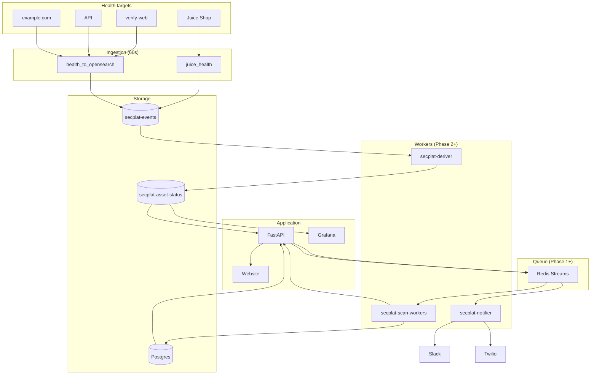

# SecPlat Architecture (One-Page)

## Current + Target Layout

**Current:** Ingestion (health + build_asset_status) runs in one container; worker-web polls Postgres for scan_jobs; API calls Slack/Twilio directly for alerts.

**Target (post–Phase 2):** Events → Queue → Workers; API is thin (auth, read posture, enqueue jobs); Deriver and Notifier are separate services.

---

## One-Page Diagram (Mermaid)

**In words:**

1. **Ingestion** (unchanged for now): health scripts → `secplat-events`; later Deriver reads events and writes `secplat-asset-status`.
2. **API**: reads OpenSearch + Postgres; creates scan jobs (DB row + optional stream message); does **not** call Slack/Twilio for routine alerts (Notifier does).
3. **Queue**: Redis Streams — `secplat.jobs.scan`, `secplat.jobs.derive`, `secplat.events.notify`.
4. **Deriver**: consumes events (or cron), derives posture with debounce, writes asset-status.
5. **Scan workers**: consume `secplat.jobs.scan`, run scans, POST findings to API, update job logs.
6. **Notifier**: consumes `secplat.events.notify`, sends Slack/Twilio; rate limits and backoff inside this service.

---

## Service Boundaries

| Service            | Reads from              | Writes to                    | Does not |
|--------------------|-------------------------|-----------------------------|----------|
| **API**            | OpenSearch, Postgres    | Postgres, (optional) Redis  | Call Slack/Twilio for alerts |
| **Deriver**        | OpenSearch (events)     | OpenSearch (asset-status)   | Touch Postgres |
| **Scan workers**   | Redis (stream), API     | API (findings, job logs)    | Direct Postgres (preferred) |
| **Notifier**       | Redis (stream)          | Slack, Twilio, Jira         | Touch Postgres/OpenSearch |

---

## Failure Isolation

- Worker crash → job stays in stream (or DB queued), retried by another replica or same after restart.
- Notifier down → notify events pile up in stream; API latency unchanged.
- Deriver down → asset-status stops updating; API still serves last state; ingestion still writes events.

---

## References

- [SECPLAT-CORPORATE-ROADMAP.md](SECPLAT-CORPORATE-ROADMAP.md) — phased plan and acceptance criteria
- [contracts/](contracts/) — event envelope and idempotency keys
