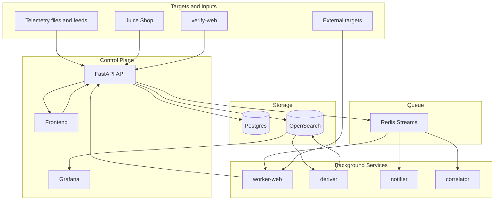

# SecPlat Architecture

## Current Production Direction

SecPlat is now aligned to a Kubernetes-first, single-tenant GA path.

- The API owns job state in Postgres.
- Workers consume Redis stream messages and use internal API job-control endpoints to claim, heartbeat, complete, or fail work.
- Workers do not connect to Postgres in the supported production topology.
- Compose remains the local and demo lane; Kubernetes is the production source of truth.

## Runtime Layout

```mermaid
flowchart TB
  subgraph targets["Targets and Inputs"]
    J[Juice Shop]
    V[verify-web]
    E[External targets]
    T[Telemetry files and feeds]
  end

  subgraph control["Control Plane"]
    API[FastAPI API]
    FE[Frontend]
    GF[Grafana]
  end

  subgraph queue["Queue"]
    RS[Redis Streams]
  end

  subgraph workers["Background Services"]
    WRK[worker-web]
    DRV[deriver]
    NOT[notifier]
    COR[correlator]
  end

  subgraph storage["Storage"]
    PG[(Postgres)]
    OS[(OpenSearch)]
  end

  FE --> API
  API --> PG
  API --> OS
  API --> RS

  RS --> WRK
  WRK --> API

  T --> API
  J --> API
  V --> API
  E --> WRK

  RS --> NOT
  RS --> COR
  OS --> DRV
  DRV --> OS

  API --> FE
  OS --> GF
```

## Service Boundaries

| Service | Reads from | Writes to | Does not |
|---|---|---|---|
| API | Postgres, OpenSearch, Redis metadata | Postgres, OpenSearch, Redis | Depend on worker-local state |
| worker-web | Redis, API | API | Connect to Postgres directly |
| deriver | OpenSearch | OpenSearch | Touch Postgres |
| notifier | Redis | Slack, Twilio, Jira | Touch Postgres or OpenSearch |
| correlator | Redis, API | API | Touch Postgres directly |

## Job Lifecycle

1. API creates a `scan_jobs` row and publishes a Redis stream message.
2. A worker reads the message and calls `POST /internal/jobs/{job_id}/claim`.
3. The worker sends heartbeats while it executes `POST /jobs/{job_id}/execute`.
4. The API performs the job-side mutation, updates terminal state, and clears claim ownership.
5. If worker-side transport or runtime failures happen before a clean terminal response, the worker calls `POST /internal/jobs/{job_id}/fail` to requeue or finalize the job.

## Phase 0 ADR Summary

- GA model: single-tenant first
- Production lane: Kubernetes
- Supported install package: Helm
- Observability stack target: OpenTelemetry Collector, Prometheus, Tempo, Grafana
- Loki and broader log shipping: deferred until after GA unless a later phase requires them

## References

- [ga-sequential-phase-plan.md](./ga-sequential-phase-plan.md)
- [security-roadmap-gap-matrix.md](./security-roadmap-gap-matrix.md)
- [../infra/k8s/README.md](../infra/k8s/README.md)
